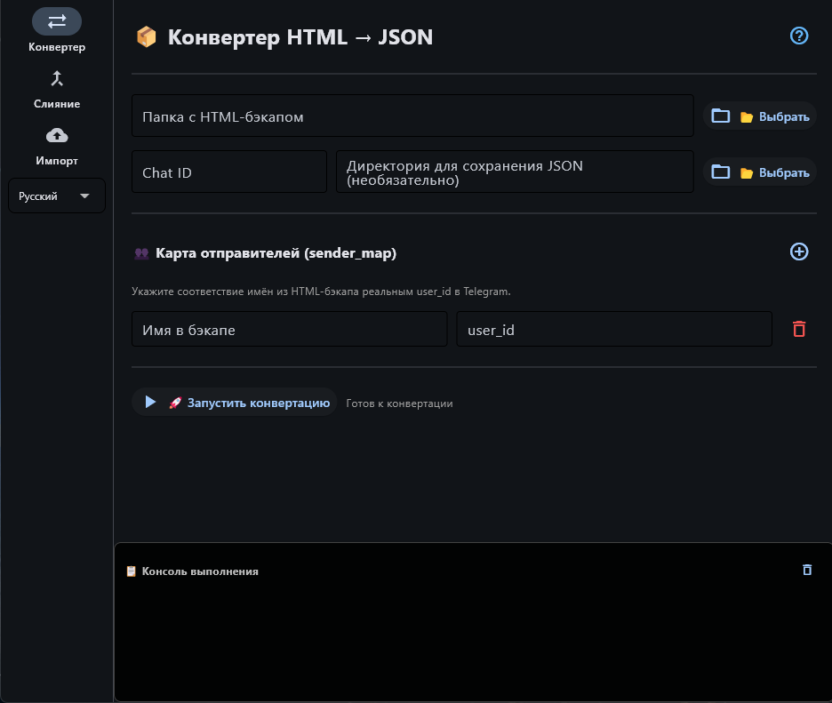
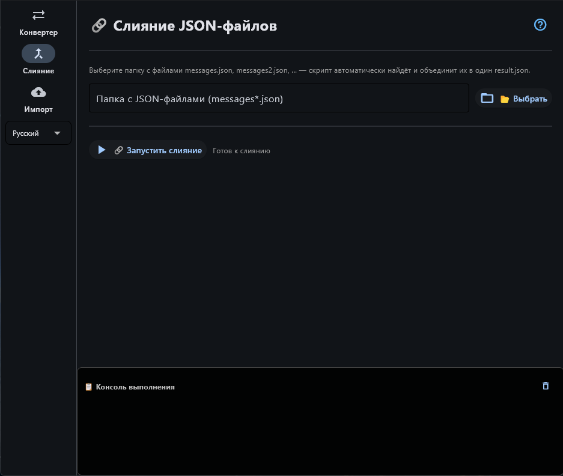
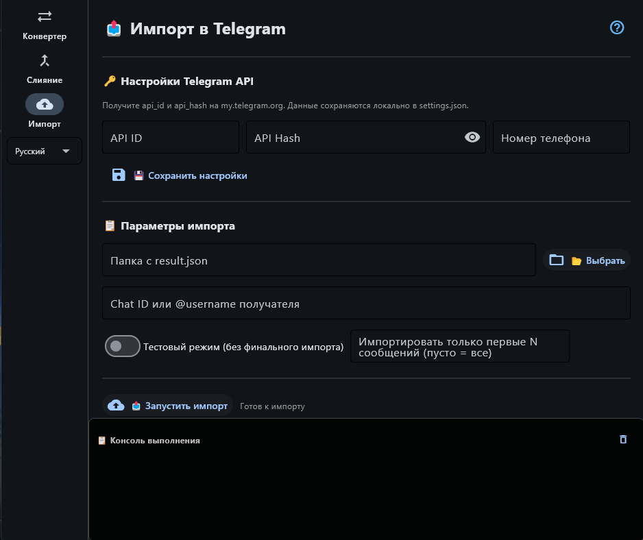

[🇷🇺 Русский](README.md) • [🇬 English](README_EN.md)

<div align="center">

# 📨 Telegram Import Studio

**HTML → JSON → Telegram**

Десктопное приложение для восстановления и импорта истории чатов Telegram Desktop:
конвертирует HTML-бэкап в JSON, объединяет части и импортирует историю
в Telegram через Telethon.

<br>

[](https://github.com/A-R-E-S/TelegramImportStudio/stargazers)
[](https://github.com/A-R-E-S/TelegramImportStudio/network/members)
[](https://github.com/A-R-E-S)

[](https://github.com/A-R-E-S/TelegramImportStudio/releases)
[](https://github.com/A-R-E-S/TelegramImportStudio/releases)
[](https://www.virustotal.com/gui/file/399958769a517c1bf079cce78270f1d7bc42aad9249a482e173b84f16893db32?nocache=1)
[](https://www.python.org/)
[](https://flet.dev/)
[](LICENSE)

</div>

---

## 🎬 Как выглядит импортированная история

<p align="center">
  
</p>

---

## 📥 Скачать

<p align="center">
  <a href="https://github.com/A-R-E-S/TelegramImportStudio/releases/latest">
    
  </a>
</p>

<p align="center">
  Или запусти из исходников — <a href="#-запуск-из-исходников">инструкция ниже</a>.
</p>

---

## ✨ Возможности

- 📦 Конвертация HTML-экспорта Telegram Desktop в JSON
- 🔗 Слияние `messages.json`, `messages2.json`, … в один `result.json`
- 📤 Импорт истории в Telegram через Telethon
  (CheckHistoryImport → Init → UploadMedia → Start)
- 🖼️ Поддержка всех типов контента:
  текст с форматированием, фото, видео, «кружки», голосовые, стикеры
  (`.webp` / `.tgs` / `.webm`), GIF, документы, геолокация, опросы,
  контакты, звонки, закреплённые сообщения, пересланные сообщения, ответы
- 🌍 Интерфейс: **RU / EN / ES / DE / FR**
- 🔐 Вход по коду из Telegram/SMS и паролю 2FA прямо в GUI
- 🧪 Тестовый режим и импорт только первых N сообщений
- 👥 Карта отправителей (sender_map): имена из бэкапа → реальные user_id
- 📊 Прогресс-бары и встроенная консоль выполнения

---

## 📸 Скриншоты

| 📦 Конвертер | 🔗 Слияние | 📤 Импорт |
|:---:|:---:|:---:|
|  |  |  |

---

🛡️ Безопасность

    Приложение работает полностью локально: бэкап, API-данные и сессия
    никуда не отправляются, кроме серверов Telegram.
    Релиз просканирован на VirusTotal — отчёт по ссылке в бейдже в шапке страницы.
## 🚀 Запуск из исходников

### Требования

- Windows 10/11 x64
- Python 3.10+

### Шаги

```bash
git clone https://github.com/A-R-E-S/TelegramImportStudio.git
cd TelegramImportStudio

python -m venv .venv
# Windows:
.venv\Scripts\activate
# Linux / macOS:
# source .venv/bin/activate

pip install -r requirements.txt
python main.py
```

## 🔑 Как получить API ID и API Hash

1. Зайди на сайт [my.telegram.org](https://my.telegram.org).
2. Войди по своему номеру телефона.
3. Открой раздел **API development tools**.
4. Скопируй `api_id` и `api_hash` в соответствующие поля на экране «Импорт» в приложении.

> 💡 Данные сохраняются локально в файле `settings.json` и никуда не отправляются.

## ❓ Частые вопросы

**Где взять Chat ID?**  
Через бота [@userinfobot](https://t.me/userinfobot) или [@getidsbot](https://t.me/getidsbot) в Telegram.

**Где взять user_id для sender_map?**  
Через бота [@userinfobot](https://t.me/userinfobot).

**Почему антивирус ругается на .exe?**  
Это ложное срабатывание на упаковку PyInstaller. Сверь SHA256 и посмотри отчёт VirusTotal выше.

**Что делает тестовый режим?**  
Проходит весь путь (подготовка, авторизация, загрузка медиа), но не запускает финальный импорт истории.

**Что будет, если во время импорта пропадёт интернет?**  
Часть файлов может не загрузиться — они будут помечены как ошибки в консоли. Импорт можно запустить повторно: пропущенные сообщения отправятся заново.

**Где хранится сессия Telegram?**  
В файле `telegram_import_gui.session` рядом с запущенным `.exe` (или рядом с `main.py`, если запускаешь из исходников).

## ⚠️ Дисклеймер

Проект предназначен для работы **с собственными данными и собственными аккаунтами**.

Автор не несёт ответственности за нарушение правил Telegram, блокировки аккаунтов, потерю данных или неправильное использование API. Используя программу, ты принимаешь риски на себя.

---

## 📈 Star History

<a href="https://star-history.com/#A-R-E-S/TelegramImportStudio&Date">
  
</a>

---

## 📄 Лицензия

Проект распространяется под лицензией [MIT](LICENSE).

---

<div align="center">

### Если проект оказался полезным — поставь ⭐
Это реально помогает развитию проекта!

</div>
